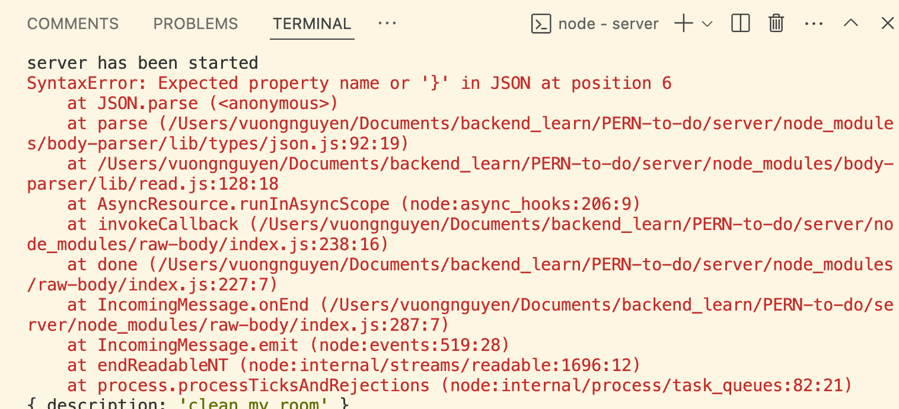

# To-do app procedure
1. Install npm, express, set up server, set PORT
2. Create database + tables + relation in PostgresSQL 
3. connect server to database —> make a .js file —> use `pg` to create a pool with the database configurations → `require` the `pool` in the `index.js` file

### Testing API with Postman:
1. Testing POST (create a to-do):

2. Testing GET request (get all to-dos):
# todo-app-pern-stack
